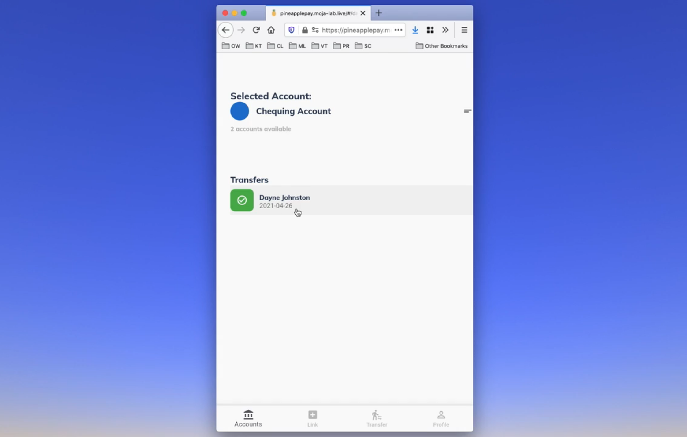

# contrib-pisp-demo-ui
### A reference end-user application for PISP on Mojaloop. Inspired by GPay.




__See it live at: https://pineapplepay.moja-lab.live/#/dashboard__

## Introduction

[contrib-pisp-demo-ui](https://github.com/mojaloop/contrib-pisp-demo-ui) was developed to demonstrate the ability of Mojaloop to make end to end transfers. It's a payment initiation app, which allows people to send money to one another. The basic features of the app are:

1. Login/Authentication
2. Account Linking
3. Dashboard
4. Third Party Initiated Transfers


**For more information about Mojaloop and PISP with Mojaloop, see:**
- [mojaloop/pisp](https://github.com/mojaloop/pisp)
- [mojaloop/mojaloop](https://github.com/mojaloop/mojaloop)
- [mojaloop.io](https://mojaloop.io/)


## Demo

- See it live at: https://pineapplepay.moja-lab.live/#/dashboard
- View a video introduction [here](https://mojaloopcommunitymeeting.us2.pathable.com/pisp-demo-pi-14#/?limit=10&sortByFields[0]=createdAt&sortByOrders[0]=-1&uid=Dg6xvE5DuqnbJpKwn)


## Docs

Full documentation can be found [here](docs/)

- The linking sequence diagrams are [here](https://github.com/mojaloop/pisp-demo-server/tree/master/docs/assets/diagrams/transfer)


## Developing Locally

This project is written in Dart, and uses Google's Cross-platform Flutter library.


### Android

1. Clone [this](https://github.com/mojaloop/pisp-demo-app-flutter) repository.
2. [Install](https://flutter.dev/docs/get-started/install) the flutter sdk.
3. [Install](https://developer.android.com/studio/install) Android Studio.
4. Install flutter and dart plugin on android studio. Go to `File->Settings->Plugins` (Windows) or `Android Studio -> Preferences->Plugins(Mac)` and install the flutter plugin.
5. Clone the repository and open the **root directory** from Android Studio
6. Go to `Settings -> Flutter` (Windows) `Android Studio -> Preferences -> Languages & Frameworks -> Flutter` (Mac)  and add the path to flutter SDK if not already present.
7. Get your google-services.json from firebase. Follow the steps [here](https://www.digitalocean.com/community/tutorials/flutter-firebase-setup) This is necessary to build the app successfully.
8. Connect device/ emulator and run the app.


```bash
keytool -list -v -keystore ~/.android/debug.keystore -alias androiddebugkey -storepass android -keypass android
```


9. Make sure you enter the app's SHA-1 fingerprint under the [Settings page](https://console.firebase.google.com/u/0/project/_/settings/general) of your Firebase console as this is required to ensure that Google sign-in functions properly. You can get the app's debug SHA-1 fingerprint by running this command: `keytool -list -v -alias androiddebugkey -keystore %USERPROFILE%\.android\debug.keystore`.
10. Connect device/ emulator and run the app.


### Web

1. Make sure you have flutter web enabled. See [this guide](https://flutter.dev/docs/get-started/web) for steps
2. Ensure that `flutter devices` outputs the following:

```
1 connected device:

Chrome (web) • chrome • web-javascript • Google Chrome 88.0.4324.182
```

```bash
git clone git@github.com:mojaloop/pisp-demo-app-flutter.git
cd pisp-demo-app-flutter
flutter run -d chrome --web-port 42181
```

## Deploying 

> Note: We only deploy the _web_ version of this project at the moment.

First, we need to set up firebase (only once)
```bash
# release to the firebase project
npm install -g firebase-tools
firebase login
firebase init

# select the following options:
# - existing project
# - mojapay-dev
# - build/web
# - rewrite - Yes
# - automatic builds - No
# - overwrite web/index.html - No
```

```bash
# Then, make sure we have the correct fido2_client
cd ..
git clone https://github.com/mojaloop/fido2-client-plugin fido2_client

cd pisp_demo_app_flutter
flutter build web
firebase deploy
```

Now go to https://mojapay-dev.web.app to see it live!

## JSON Serialization

To generate the files that handle JSON encoding/decoding for model objects (e.g. consent.g.dart), run `flutter pub run build_runner build` in the project directory.
   
## Flutter handy snippets

```bash
# upgrade dependencies
flutter pub upgrade

# rebuild generated files
flutter pub run build_runner build --delete-conflicting-outputs

# specify a flutter version to use
flutter version v1.9.1+hotfix.3
```


## FIDO Credential Payload Snippets


### 1: `qYvVS3ZJoa-71WrVSG1n2F_YjRV_s9tIhUDeR4eCMO_-aaVMGJIIwVUMAUsS3FxUa7qjOYCfNgmX5m1Uthi7Eg`

#### Attestation:

deriving challenge from consent: {id: clLx3Jpm0fr8BRW96BSq, consentId: 9886a031-4386-4f92-9344-56f88275e1b5, party: {partyIdInfo: {partyIdType: OPAQUE, partyIdentifier: asd, fspId:
applebank}}, status: CONSENT_GRANTED, userId: VQLEyvz9zYVucLbjJMErpwSFCVD2, consentRequestId: c51ec534-ee48-4575-b6a9-ead2955b8069, accounts: [{id: 5cb34058-401a-4454-be61-e1152455616d,
currency: TZS}, {id: d2f1f253-ce12-4bf7-86da-e33d1dd5ecfa, currency: TZS}], authChannels: [OTP], authToken: 123, initiatorId: pispa, participantId: applebank, scopes: [{actions:
[accounts.getBalance, accounts.transfer], accountId: 6223a090-b87d-423b-85a5-1883272826fe}, {actions: [accounts.getBalance], accountId: fe6a6cfc-83bd-4805-b4d2-88e7e796712d}]}
⚠️  AccountLinkingFlowController - signChallenge, signing challenge c19aac0a2c88f72c80b757fdaeb193d44db314f8c8c50b11058101be00d0b27e
calling window.navigator.credentials.create with options:
 {"challenge":{"0":99,"1":49,"2":57,"3":97,"4":97,"5":99,"6":48,"7":97,"8":50,"9":99,"10":56,"11":56,"12":102,"13":55,"14":50,"15":99,"16":56,"17":48,"18":98,"19":55,"20":53,"21":55,"22":102,
 "23":100,"24":97,"25":101,"26":98,"27":49,"28":57,"29":51,"30":100,"31":52,"32":52,"33":100,"34":98,"35":51,"36":49,"37":52,"38":102,"39":56,"40":99,"41":56,"42":99,"43":53,"44":48,"45":98,"
 46":49,"47":49,"48":48,"49":53,"50":56,"51":49,"52":48,"53":49,"54":98,"55":101,"56":48,"57":48,"58":100,"59":48,"60":98,"61":50,"62":55,"63":101},"rp":{"name":"Pineapple
 Pay","id":"localhost"},"user":{"id":{},"name":"test@example.com","displayName":"Example User"},"pubKeyCredParams":[{"alg":-7,"type":"public-key"}],"timeout":60000,"attestation":"direct"}
⚠️  AccountLinkingFlowController - signChallenge, credential is: {id: 45c-TkfkjQovQeAWmOy-RLBHEJ_e4jYzQYgD8VdbkePgM5d98BaAadadNYrknxgH0jQEON8zBydLgh1EqoC9DA, rawId: [227, 151, 62, 78, 71,
228, 141, 10, 47, 65, 224, 22, 152, 236, 190, 68, 176, 71, 16, 159, 222, 226, 54, 51, 65, 136, 3, 241, 87, 91, 145, 227, 224, 51, 151, 125, 240, 22, 128, 105, 214, 157, 53, 138, 228, 159, 24,
7, 210, 52, 4, 56, 223, 51, 7, 39, 75, 130, 29, 68, 170, 128, 189, 12], response: {attestationObject: [163, 99, 102, 109, 116, 102, 112, 97, 99, 107, 101, 100, 103, 97, 116, 116, 83, 116,
109, 116, 163, 99, 97, 108, 103, 38, 99, 115, 105, 103, 88, 70, 48, 68, 2, 32, 45, 245, 247, 80, 104, 255, 66, 226, 241, 215, 146, 25, 213, 0, 248, 227, 142, 20, 65, 251, 115, 39, 247, 93,
134, 90, 94, 100, 193, 97, 107, 161, 2, 32, 103, 172, 3, 37, 140, 49, 120, 115, 33, 137, 79, 114, 241, 188, 139, 73, 46, 143, 213, 182, 30, 123, 42, 39, 213, 212, 231, 170, 237, 99, 91, 150,
99, 120, 53, 99, 129, 89, 2, 193, 48, 130, 2, 189, 48, 130, 1, 165, 160, 3, 2, 1, 2, 2, 4, 11, 5, 205, 83, 48, 13, 6, 9, 42, 134, 72, 134, 247, 13, 1, 1, 11, 5, 0, 48, 46, 49, 44, 48, 42, 6,
3, 85, 4, 3, 19, 35, 89, 117, 98, 105, 99, 111, 32, 85, 50, 70, 32, 82, 111, 111, 116, 32, 67, 65, 32, 83, 101, 114, 105, 97, 108, 32, 52, 53, 55, 50, 48, 48, 54, 51, 49, 48, 32, 23, 13, 49,
52, 48, 56, 48, 49, 48, 48, 48, 48, 48, 48, 90, 24, 15, 50, 48, 53, 48, 48, 57, 48, 52, 48, 48, 48, 48, 48, 48, 90, 48, 110, 49, 11, 48, 9, 6, 3, 85, 4, 6, 19, 2, 83, 69, 49, 18, 48, 16, 6,
3, 85, 4, 10, 12, 9, 89, 117, 98, 105, 99, 111, 32, 65, 66, 49, 34, 48, 32, 6, 3, 85, 4, 11, 12, 25, 65, 117, 116, 104, 101, 110, 116, 105, 99, 97, 116, 111, 114, 32, 65, 116, 116, 101, 115,
116, 97, 116, 105, 111, 110, 49, 39, 48, 37, 6, 3, 85, 4, 3, 12, 30, 89, 117, 98, 105, 99, 111, 32, 85, 50, 70, 32, 69, 69, 32, 83, 101, 114, 105, 97, 108, 32, 49, 56, 52, 57, 50, 57, 54, 49,
57, 48, 89, 48, 19, 6, 7, 42, 134, 72, 206, 61, 2, 1, 6, 8, 42, 134, 72, 206, 61, 3, 1, 7, 3, 66, 0, 4, 33, 26, 111, 177, 181, 137, 37, 203, 10, 193, 24, 95, 124, 42, 227, 168, 180, 136, 16,
20, 121, 177, 30, 255, 245, 85, 224, 125, 151, 81, 189, 43, 23, 106, 37, 45, 238, 89, 236, 227, 133, 153, 32, 91, 179, 234, 40, 191, 143, 215, 252, 125, 167, 92, 5, 66, 114, 174, 72, 88, 229,
145, 252, 90, 163, 108, 48, 106, 48, 34, 6, 9, 43, 6, 1, 4, 1, 130, 196, 10, 2, 4, 21, 49, 46, 51, 46, 54, 46, 49, 46, 52, 46, 49, 46, 52, 49, 52, 56, 50, 46, 49, 46, 49, 48, 19, 6, 11, 43,
6, 1, 4, 1, 130, 229, 28, 2, 1, 1, 4, 4, 3, 2, 4, 48, 48, 33, 6, 11, 43, 6, 1, 4, 1, 130, 229, 28, 1, 1, 4, 4, 18, 4, 16, 20, 154, 32, 33, 142, 246, 65, 51, 150, 184, 129, 248, 213, 183, 241,
245, 48, 12, 6, 3, 85, 29, 19, 1, 1, 255, 4, 2, 48, 0, 48, 13, 6, 9, 42, 134, 72, 134, 247, 13, 1, 1, 11, 5, 0, 3, 130, 1, 1, 0, 62, 254, 163, 223, 61, 42, 224, 114, 87, 143, 126, 4, 208,
221, 90, 75, 104, 219, 1, 175, 232, 99, 46, 24, 180, 224, 184, 115, 67, 24, 145, 25, 108, 24, 75, 235, 193, 213, 51, 162, 61, 119, 139, 177, 4, 8, 193, 185, 170, 65, 78, 117, 118, 133, 91, 9,
54, 151, 24, 179, 72, 175, 92, 239, 108, 176, 48, 134, 114, 214, 31, 184, 189, 155, 134, 161, 10, 166, 130, 206, 140, 45, 78, 240, 144, 237, 80, 84, 24, 254, 83, 212, 206, 30, 98, 122, 40,
243, 114, 3, 9, 88, 208, 143, 250, 89, 27, 196, 24, 128, 225, 142, 138, 12, 237, 26, 133, 128, 127, 144, 150, 113, 65, 122, 11, 69, 50, 21, 179, 141, 193, 71, 42, 36, 73, 118, 64, 180, 232,
107, 254, 196, 241, 84, 99, 155, 133, 184, 232, 128, 20, 150, 54, 36, 56, 53, 89, 1, 43, 252, 135, 124, 11, 68, 236, 125, 167, 148, 210, 6, 84, 178, 154, 220, 29, 186, 92, 80, 123, 240, 202,
109, 243, 82, 188, 205, 222, 116, 13, 46, 167, 225, 8, 36, 162, 206, 57, 79, 144, 77, 29, 153, 65, 94, 58, 124, 69, 181, 254, 40, 122, 155, 203, 220, 105, 142, 139, 220, 213, 180, 121, 138,
92, 237, 53, 222, 138, 53, 9, 2, 10, 20, 183, 38, 191, 191, 57, 167, 68, 7, 156, 185, 143, 91, 157, 202, 9, 183, 195, 235, 188, 189, 162, 175, 105, 3, 104, 97, 117, 116, 104, 68, 97, 116, 97,
88, 196, 73, 150, 13, 229, 136, 14, 140, 104, 116, 52, 23, 15, 100, 118, 96, 91, 143, 228, 174, 185, 162, 134, 50, 199, 153, 92, 243, 186, 131, 29, 151, 99, 65, 0, 0, 0, 2, 20, 154, 32, 33,
142, 246, 65, 51, 150, 184, 129, 248, 213, 183, 241, 245, 0, 64, 227, 151, 62, 78, 71, 228, 141, 10, 47, 65, 224, 22, 152, 236, 190, 68, 176, 71, 16, 159, 222, 226, 54, 51, 65, 136, 3, 241,
87, 91, 145, 227, 224, 51, 151, 125, 240, 22, 128, 105, 214, 157, 53, 138, 228, 159, 24, 7, 210, 52, 4, 56, 223, 51, 7, 39, 75, 130, 29, 68, 170, 128, 189, 12, 165, 1, 2, 3, 38, 32, 1, 33,
88, 32, 44, 185, 150, 161, 197, 251, 221, 170, 219, 175, 64, 79, 92, 14, 249, 163, 241, 247, 184, 100, 246, 103, 126, 16, 207, 43, 138, 191, 188, 192, 88, 31, 34, 88, 32, 189, 7, 87, 3, 85,
199, 154, 164, 16, 174, 214, 202, 126, 222, 236, 238, 171, 64, 138, 245, 96, 192, 157, 44, 27, 17, 65, 220, 22, 102, 147, 213], clientDataJSON: [123, 34, 116, 121, 112, 101, 34, 58, 34, 119,
101, 98, 97, 117, 116, 104, 110, 46, 99, 114, 101, 97, 116, 101, 34, 44, 34, 99, 104, 97, 108, 108, 101, 110, 103, 101, 34, 58, 34, 89, 122, 69, 53, 89, 87, 70, 106, 77, 71, 69, 121, 89, 122,
103, 52, 90, 106, 99, 121, 89, 122, 103, 119, 89, 106, 99, 49, 78, 50, 90, 107, 89, 87, 86, 105, 77, 84, 107, 122, 90, 68, 81, 48, 90, 71, 73, 122, 77, 84, 82, 109, 79, 71, 77, 52, 89, 122,
85, 119, 89, 106, 69, 120, 77, 68, 85, 52, 77, 84, 65, 120, 89, 109, 85, 119, 77, 71, 81, 119, 89, 106, 73, 51, 90, 81, 34, 44, 34, 111, 114, 105, 103, 105, 110, 34, 58, 34, 104, 116, 116,
112, 58, 47, 47, 108, 111, 99, 97, 108, 104, 111, 115, 116, 58, 52, 50, 49, 56, 49, 34, 44, 34, 99, 114, 111, 115, 115, 79, 114, 105, 103, 105, 110, 34, 58, 102, 97, 108, 115, 101, 44, 34,
111, 116, 104, 101, 114, 95, 107, 101, 121, 115, 95, 99, 97, 110, 95, 98, 101, 95, 97, 100, 100, 101, 100, 95, 104, 101, 114, 101, 34, 58, 34, 100, 111, 32, 110, 111, 116, 32, 99, 111, 109,
112, 97, 114, 101, 32, 99, 108, 105, 101, 110, 116, 68, 97, 116, 97, 74, 83, 79, 78, 32, 97, 103, 97, 105, 110, 115, 116, 32, 97, 32, 116, 101, 109, 112, 108, 97, 116, 101, 46, 32, 83, 101,
101, 32, 104, 116, 116, 112, 115, 58, 47, 47, 103, 111, 111, 46, 103, 108, 47, 121, 97, 98, 80, 101, 120, 34, 125]}}


#### Assertion:

<!-- TODO: run this again, but with the updated challenge stuff -->
```
calling window.navigator.credentials.get with options:
 {"challenge":{"0":0,"1":0,"2":0,"3":0,"4":0,"5":0,"6":0,"7":0,"8":0,"9":0,"10":0,"11":0,"12":0,"13":1,"14":2,"15":3},"allowCredentials":[{"id":{"0":227,"1":151,"2":62,"3":78,"4":71,"5":228,"
 6":141,"7":10,"8":47,"9":65,"10":224,"11":22,"12":152,"13":236,"14":190,"15":68,"16":176,"17":71,"18":16,"19":159,"20":222,"21":226,"22":54,"23":51,"24":65,"25":136,"26":3,"27":241,"28":87,"
 29":91,"30":145,"31":227,"32":224,"33":51,"34":151,"35":125,"36":240,"37":22,"38":128,"39":105,"40":214,"41":157,"42":53,"43":138,"44":228,"45":159,"46":24,"47":7,"48":210,"49":52,"50":4,"51
 ":56,"52":223,"53":51,"54":7,"55":39,"56":75,"57":130,"58":29,"59":68,"60":170,"61":128,"62":189,"63":12},"type":"public-key"}],"timeout":60000}
⚠️  main - Signed credential is: {id: 45c-TkfkjQovQeAWmOy-RLBHEJ_e4jYzQYgD8VdbkePgM5d98BaAadadNYrknxgH0jQEON8zBydLgh1EqoC9DA, rawId: [227, 151, 62, 78, 71, 228, 141, 10, 47, 65, 224, 22, 152,
236, 190, 68, 176, 71, 16, 159, 222, 226, 54, 51, 65, 136, 3, 241, 87, 91, 145, 227, 224, 51, 151, 125, 240, 22, 128, 105, 214, 157, 53, 138, 228, 159, 24, 7, 210, 52, 4, 56, 223, 51, 7, 39,
75, 130, 29, 68, 170, 128, 189, 12], response: {authenticatorData: [73, 150, 13, 229, 136, 14, 140, 104, 116, 52, 23, 15, 100, 118, 96, 91, 143, 228, 174, 185, 162, 134, 50, 199, 153, 92,
243, 186, 131, 29, 151, 99, 1, 0, 0, 0, 8], clientDataJSON: [123, 34, 116, 121, 112, 101, 34, 58, 34, 119, 101, 98, 97, 117, 116, 104, 110, 46, 103, 101, 116, 34, 44, 34, 99, 104, 97, 108,
108, 101, 110, 103, 101, 34, 58, 34, 65, 65, 65, 65, 65, 65, 65, 65, 65, 65, 65, 65, 65, 65, 65, 65, 65, 65, 69, 67, 65, 119, 34, 44, 34, 111, 114, 105, 103, 105, 110, 34, 58, 34, 104, 116,
116, 112, 58, 47, 47, 108, 111, 99, 97, 108, 104, 111, 115, 116, 58, 52, 50, 49, 56, 49, 34, 44, 34, 99, 114, 111, 115, 115, 79, 114, 105, 103, 105, 110, 34, 58, 102, 97, 108, 115, 101, 44,
34, 111, 116, 104, 101, 114, 95, 107, 101, 121, 115, 95, 99, 97, 110, 95, 98, 101, 95, 97, 100, 100, 101, 100, 95, 104, 101, 114, 101, 34, 58, 34, 100, 111, 32, 110, 111, 116, 32, 99, 111,
109, 112, 97, 114, 101, 32, 99, 108, 105, 101, 110, 116, 68, 97, 116, 97, 74, 83, 79, 78, 32, 97, 103, 97, 105, 110, 115, 116, 32, 97, 32, 116, 101, 109, 112, 108, 97, 116, 101, 46, 32, 83,
101, 101, 32, 104, 116, 116, 112, 115, 58, 47, 47, 103, 111, 111, 46, 103, 108, 47, 121, 97, 98, 80, 101, 120, 34, 125], signature: [48, 69, 2, 32, 55, 9, 68, 27, 185, 104, 226, 201, 85, 207,
236, 63, 33, 2, 153, 136, 182, 223, 15, 49, 23, 126, 103, 221, 19, 97, 201, 67, 85, 193, 13, 167, 2, 33, 0, 248, 185, 221, 241, 208, 103, 211, 163, 138, 144, 72, 0, 171, 77, 1, 85, 185, 135,
243, 188, 155, 64, 119, 215, 149, 253, 88, 225, 18, 106, 193, 15], userHandle: []}}

```