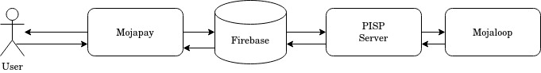

# Architecture

The high level architecture of our app is shown here.

The app never directly talks to the PISP server. We have firebase in between and the app and the server communicate through it.

 This decision was made to deal with the asynchronous nature of Mojaloop. Firebase firestore with it's real time data delivery capabilities is great for our use case.

Let us now understand how the features of Mojapay were implemented. For every feature we see what models were needed to implement it, the firebase schema for these models, the business logic between different controllers and the ui pages involved. Let's dive in!
