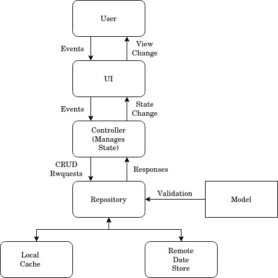

# Design of Mojapay Codebase

A high level view of the architecture of Mojapay looks like this. We have a few components here. In the code, we have separate modules for each of these layers under '/lib'.

1. #### UI
    This is the layer that the user of the app interacts with. All the views that a user can see and the interactions they can do, fall under this layer. The job of this layer is to only put down the layout of the pages. It shouldn't have any business logic in it. The job of the UI layer is also to notify events to the next layer, i.e the Controller layer. The events captured by the UI layer are generated by the user.

    Note: Thanks to Get, all our ui pages are stateless even if they contain state. This helps save on memory usage and only those components which need to be reactive can be wrapped around a GetBuilder widget. See code for more details

2. #### Controller
    This layer is responsible for managing all the state of the app. All the business logic of our app sits on this layer. All controllers inherit from the GetxController base class in. The state can be split into two kinds. App state and ephemeral state.

  - App State - Refers to state which is required at multiple places in the widget tree. A good example would be the logged in user. We show different screens based on whether or not the user is logged in. Controllers which manage app state are called App Controllers. The different kinds of app controllers are mentioned below.
   - Ephemeral State: This state can be limited to a single page and doesn't need to go across the widget tree. For example, logic for what needs to be done when a button is pressed. Controllers which manage ephemeral state are called Ephemeral Controllers

3. #### Models
    This layer contains models corresponding to our firestore schema. It contains code to generate Models to and from json objects and validation logic for these models. All models in our App implement the 'Model' interface.
4. #### Repository
   This layer is responsible for talking to the remote data sources and/or local caches and figuring out if the data needs to be fetched again. The repository layer talks to firebase in our case but can easily be changed to use say a RESTful api without changing the rest of the app. The repository layer exposes functions which will be used by the Controller layer to fetch/update data. The different kinds of repositories are mentioned below.

## Other Layers

5. **Bindings**: Bindings tell Get which ephemeral controllers hold logic for which ui pages. This helps Get reduce the memory footprint of our app by clearing pages which are not currently being displayed.

6. **Routes**: Routes hold the configuration for our named routes. We use the navigation solution given by Get.

7. **Exceptions**: This layer holds our various kinds of expectations used throughout the app. For example, Exceptions related to auth failure are all listed in auth_exception.dart

8. **Utils**: Contain common utility functions used throughout the app.

9. **Config**: This layer has information about the configuration of our app. For example we can choose to not use the actual repositories and use stub repositories by just changing a constant in config.dart. This helps us during developing the UI.

## App Controllers
1. We have two main app controllers to hold app state
   - AuthController - Holds the information about the current logged in user and the user's phone number.
   - AccountController - Holds the information about the accounts the current logged in user has linked to MojaPay. 

## Repositories
1. AccountRepository - Exposes methods which help fetch data from firestore accounts collection.
2. TransactionRepository - Exposes methods which help fetch data from firestore transactions collection.