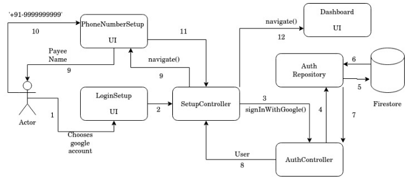

# Mojapay Setup

When user opens app for first tiime, or logs out and opens it, show Mojapay setup flow which allows user to sign in with google account and enter phone number to which accounts are linked.

Components of the app this feature depends on:

### Controllers

1. AuthController
2. SetupController

### Repositories

1. AuthRepository 

### UI Pages

1. LoginSetup - UI for page which allows google login.
2. PhoneNumberSetup - UI for page which allows users to enter phone numbers.

## Business Logic

1. User tries to login with google. Chooses a google account to sign in with.
2. UI notifies SetupController of the event.
3. SetupController calls signInWithGoogle() on AuthController.
4. AuthController asks AuthRepository to signInWithGoogle.
5. AuthRepository requests firestore.
6. Firestore responds with user json data.
7. AuthRepository forms User object using User Model and return the User Object to AuthController.
8. AuthController returns User to SetupController.
9. SetupController switches UI to PhoneNumberSetup.
10. User enters phone number.
11. SetupController validates phone number. 
12. SetupController navigates to Dashboard UI. Entering phone nunber during Mojapay setup is optional. No validation required here.
