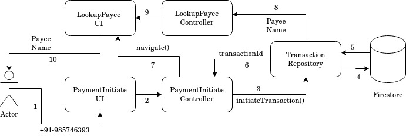

# Payment Initiation

Enter payee phone number, initiate a transaction and choose payee.

Components of the app this feature depends on:

### Controllers

1. AuthController
2. PaymentInitiateController
3. LookupPayeeController

### Repositories

1. TransactionRepository 

### UI Pages

1. PaymentInitiate
2. LookupPayee

## Business Logic

1. User enters payee phone number on PaymentInitiate screen.
2. Event triggered in PaymentInitiate Controller.
3. PaymentInitiateController asks TransactionRepository to initiate transaction.
4. TransactionRepository writes new transaction document to firebase. 
5. Firebase responds with transaction id.
6. transactionId is returned to PaymentInitiateController.
7. PaymentInitiateController navigates to LookupPayee screen. This screen still shows a spinner until 9 is completed.
8. Server responds to Firebase with payeeName which inturn notifies TransactionRepository. This info is passed to LookupPayeeController.
9. LookupPayee Screen shows payee name.
10. User sees the name and verifies if we found the right payee.
