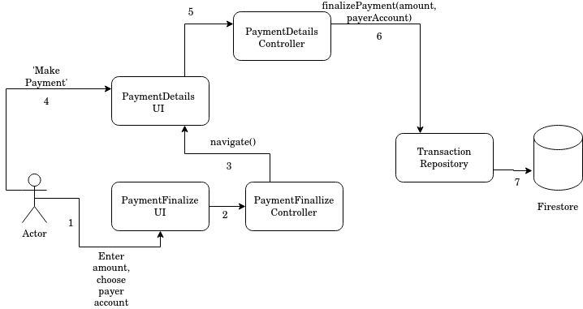

# Enter Payment Details

Enter transaction amount and choose which payer account to pay from amongst one of the already linked accounts.

Components of the app this feature depends on:

### Controllers

1. PaymentFinalizeController
2. PaymentDetailsController
3. PaymentInitiateController

### Repositories

1. TransactionRepository 

### UI Pages

1. PaymentFinalize
2. PaymentDetails

## Business Logic

1. User enters amount to be paid and chooses an account from one of the linked accounts.
2. PaymentFinalize UI passes this info to the PaymentFinalizeController. 
3. The controller navigates to PaymentDetails UI.
4. The user verifies the details and taps on 'Make Payment'.
5. PaymentDetails UI asks PaymentDetailsController to make payment.
6. PaymentDetailsController asks TransactionRepository to finalize payment with the details entered by the user.
7. TransacionRepository updates the firestore document corresponding to this tracsaction with the details. To know more about what exactly is updated, refer to [this](https://github.com/mojaloop/pisp-demo-server/tree/master/docs/assets/diagrams/transfer).

