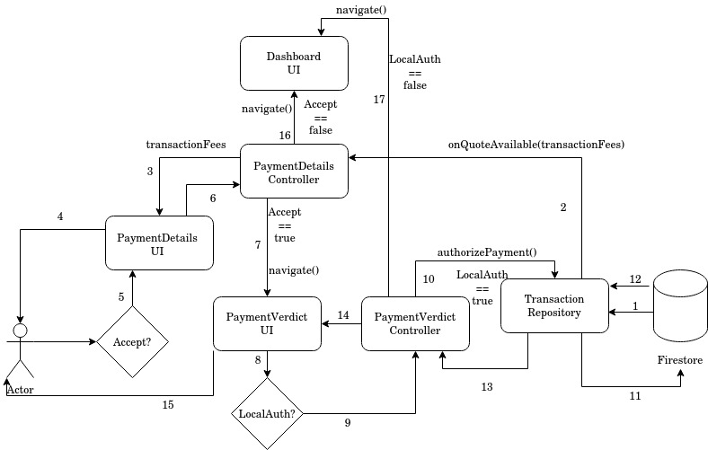

# Transfer Fee Quote and Payment Authorization

Wait from authorization request from Firebase, look for quote and show transaction fees to user. Ask user if they still want to continue. If they do, locally authenticate the user using some biometric or pin. Upon successful local authorization, sign the challenge using the private key stored on the device and update firestore with the signed challenge and other details.

Components of the app this feature depends on:
   
### Controllers

1. PaymentDetailsController
2. PaymentVerdictController
3. PaymentInitiateController
4. PaymentFinalizeController

### Repositories

1. TransactionRepository 

### UI Pages

1. PaymentDetails
2. PaymentVerdict

## Business Logic

1. Firestore returns with status = 'AUTHORIZATION_REQUIRED', quote, and challenge to TransactionRepository.
2. TransactionRepository tells PaymentDetailsController that quote is available.
3. PaymentDetailsController passes transactionFees to PaymentDetails UI.
4. The UI asks the user if they agree to this fees, and want to proceed.
5. The choice of the user is captured by PaymentDetails UI. 
6. PaymentDetails UI passes this choice to PaymentDetailsController.
7. If the choice was true, paymentDetailsController changes UI to PaymentVerdict UI.
8. Local biometric authorization happens.
9. LocalAuth result is passed to PaymentVerdictController.
10. If LocalAuth == true, the challenge is signed using the private key on the device and PaymentVerdictController asks TransactionRepository to authorizePayment().
11. TransactionRepository asks Firestore to authorize payment by adding the signed challenge to transaction document.
12. On successful authorization Firestore responds with status = 'SUCCESS' to TransactionRepository. On error, the error is reported.
13. TransactionRepository notifies PaymentVerdictController about the transaction verdict.
14. Depecding on the verdict PaymentVerdictController updates PaymentV UI.
15. User sees transaction status and is redirected back to dashboard. 
16. If user doesn't accept transaction fees, the transaction terminated and user is redirected to dashboard.
17. If LocalAuth fails, the transaction is terminated and user is redirected to dashboard.
