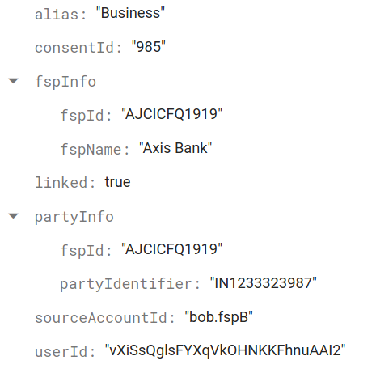
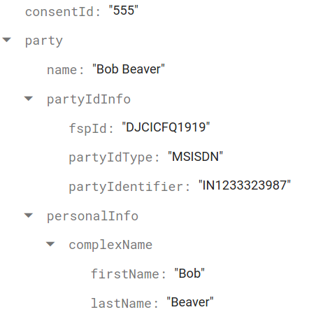
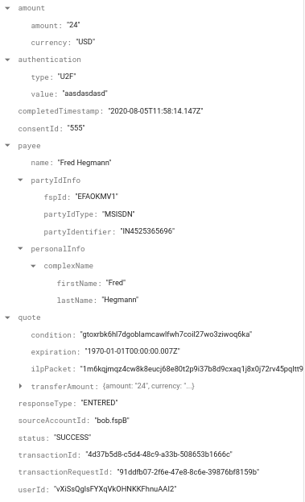

# Firestore Schema

We have three collections on our firestore.

## Accounts

The Accounts collection directly maps to the Account Model. Here is a sample document in this collection.

## Consents

Here is a sample document in the Consents collection.

## Transactions

The Transactions collection directly maps to the Transaction Model. Here is a sample document in this collection.

